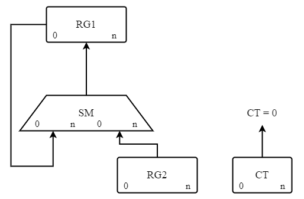
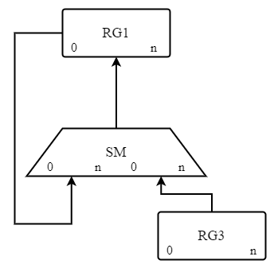
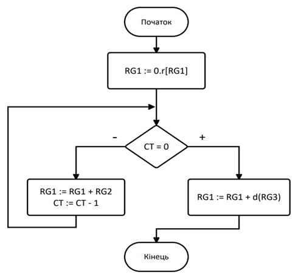
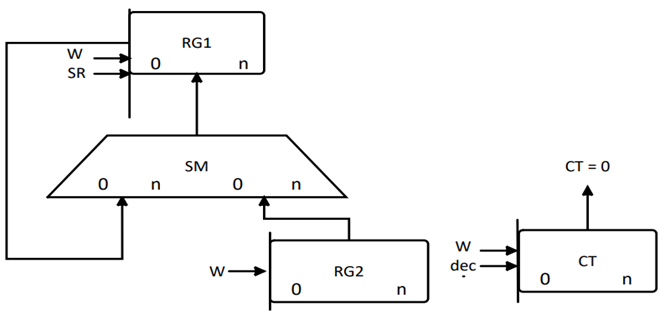
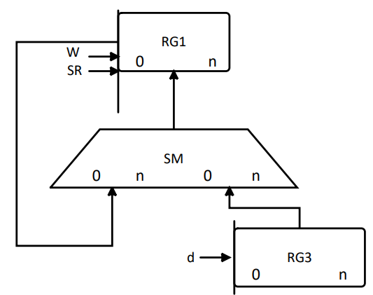
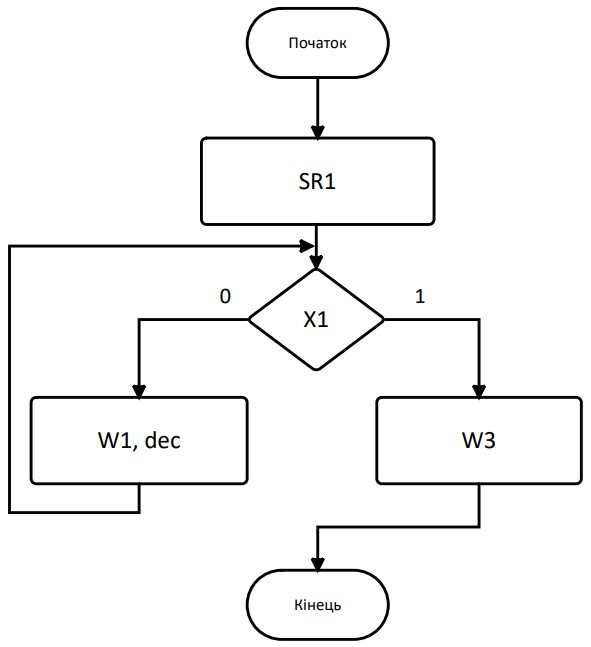

# Тема: Дослідження роботи лічильників

## 📘 Теоретичні відомості

### Операційні схеми та мікроалгоритми

🛠️ Операційні схеми та мікроалгоритми
🔹 Мікрооперація — елементарна дія над машинним словом, яка змінює його значення.
🔹 Машинне слово — набір бітів, наприклад 01011001, або позначене ідентифікатором типу RG1, CT.

📌 Ідентифікатори:

Починаються з літери.

Часто позначають вузли чи регістри, наприклад: RG1, CT.

Довжина та розряди можуть уточнюватися в дужках: RG1(0:7).

🔄 Основні мікрооперації:
Пересилання: RG1 := RG2 — передача слова з одного регістру до іншого.

Підсумовування: RG1 := RG2 + RG3

Зсув: RG1 := SHL(RG2) або SHR

Інкремент: RG := RG + 1

Декремент: RG := RG - 1

Інверсія: RG := NOT(RG)

📌 Оператор присвоювання: := — позначає виконання мікрооперації.

📋 Мікроалгоритми

Мікроалгоритм — це послідовність мікрооперацій, яка реалізує задане перетворення інформації.

📊 Опис мікроалгоритмів
Мікроалгоритми можуть бути подані у двох формах:

1. 📝 Змістовна форма
   
 - Запис мікрооперацій через оператори присвоювання: Наприклад: RG1 := RG2 + RG3

 - Опис на рівні логіки виконання.

 - Вимагає операційної схеми пристрою (схеми вузлів і шляхів передачі даних).

2. 🔧 Закодована форма
 - Кожна мікрооперація подається через набір керуючих сигналів.

 - Вимагає функціональної схеми пристрою з поясненням механізму керування.

 - Дає змогу реалізувати алгоритм на апаратному рівні, з урахуванням сигналів увімкнення/вимкнення вузлів.

📐 Опис графічно:

 - За допомогою ГСА (граф-схема алгоритму) або ЛСА (лінійна схема алгоритму).

⚙️ Синтез операційних пристроїв з розподіленою логікою

Операційні пристрої з розподіленою логікою (або з закріпленими мікроопераціями) — це такі пристрої, де кожен вузол (регістр, лічильник тощо) має власну логіку для реалізації мікрооперацій.

🛠 Структурні частини ОП:

 - Управляючий автомат (УА) — формує керуючі сигнали;

 - Операційний автомат (ОА) — виконує мікроалгоритм (тобто перетворює дані).

📐 Етапи розробки ОП з розподіленою логікою:
1. Розробка операційних схем:

   - Для кожної операції створюється схема.
   - Складається змістовний мікроалгоритм (МА).

   - Вибираються мікроалгоритми, що легко поєднуються (наприклад, мають спільні джерела даних).

2. Визначення розрядності:

   - Встановлюються розміри регістрів, лічильників.

   - Проводиться логічне моделювання (наприклад, діаграма станів регістрів під час виконання МА).

3. Функціональна схема пристрою:

   - Розробляється функціональна структура ОП.

   - Вказуються керуючі сигнали для кожного вузла.

4. Закодований мікроалгоритм:

   - Складається структурований закодований МА для керування ОП.

5. Синтез УА (пристрою керування):

   - Проєктування управляючого автомата на основі мікроалгоритму.

6. Логічна схема:
   - Побудова схеми в обраному елементному базисі (наприклад, І-НЕ, АБО-НЕ).

## 🧪 Хід роботи

### Вхідні дані

Функція: D=0,5AB-C

**Побудова операційної схеми для обчислення виразу D = 0,5·A·B – C**

Рис. 1. Операційна схема 1 для обчислення заданої функції

Рис. 2. Операційна схема 2 для обчислення заданої функції

✅ **Побудова змістовного мікроалгоритму обчислення виразу D = 0,5·A·B – C**

Рис. 3. Змістовний мікроалгоритм

**Функціональна схема операційного пристрою із вказанням керуючих сигналів для кожного вузла**

Рис. 4. Функціональна схема ОП 1

Рис. 5. Функціональна схема ОП 2

 ✅ **Таблиця 1 - Таблиця кодування мікрооперацій**

| №  | Мікрооперація          | Керуючі сигнали | Тривалість сигналів |
|----|------------------------|----------------|----------------------|
| Y1 | RG1 := 0.r[RG1]        | SR1            | t                    |
| Y2 | RG1 := RG1 + RG2       | W1             | t                    |
| Y3 | CT := CT – 1           | dec            | t                    |
| Y4 | RG1 := RG1 + d(RG3)    | W3             | t                    |

🔍 **Таблиця 2 - Таблиця кодування логічних умов**

| №   | Логічна умова   | Позначення |
|-----|------------------|-------------|
| X1  | `CT = 0`         | `X1`        |

Рис 6. Закодований мікроалгоритм автомата

